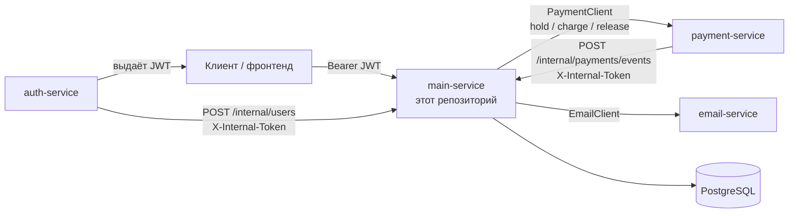
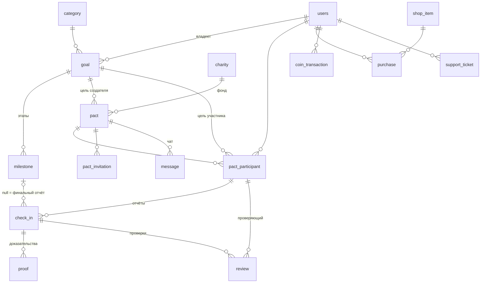
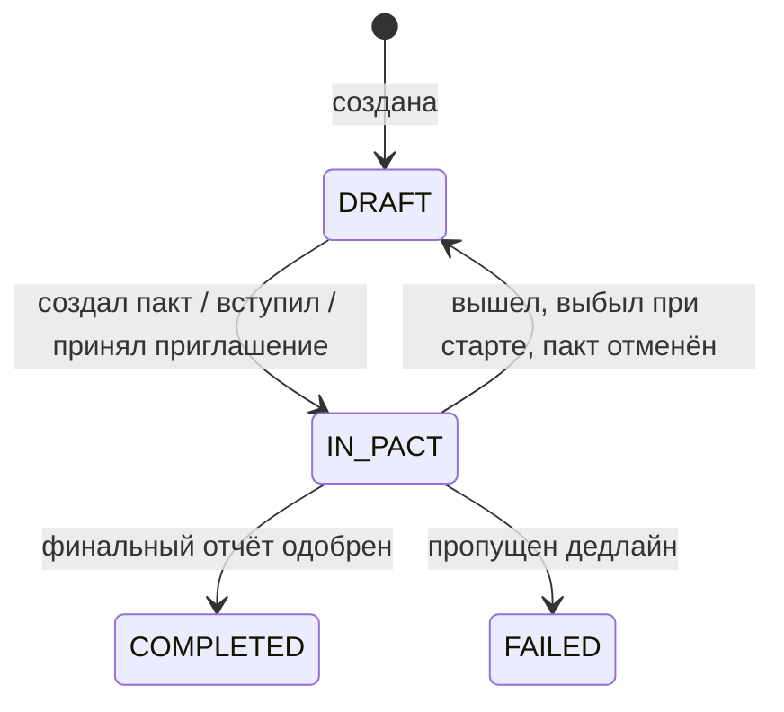
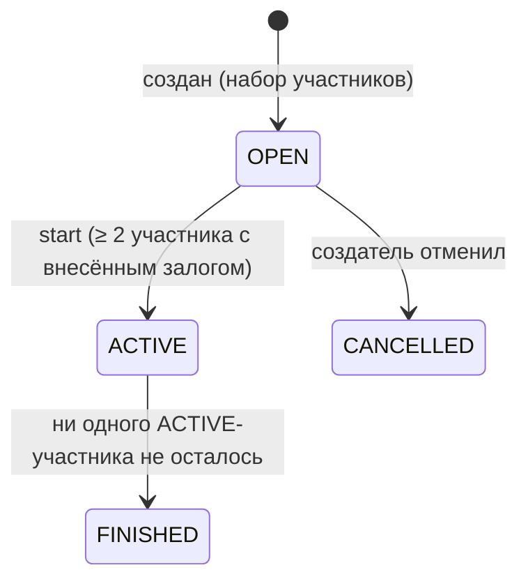
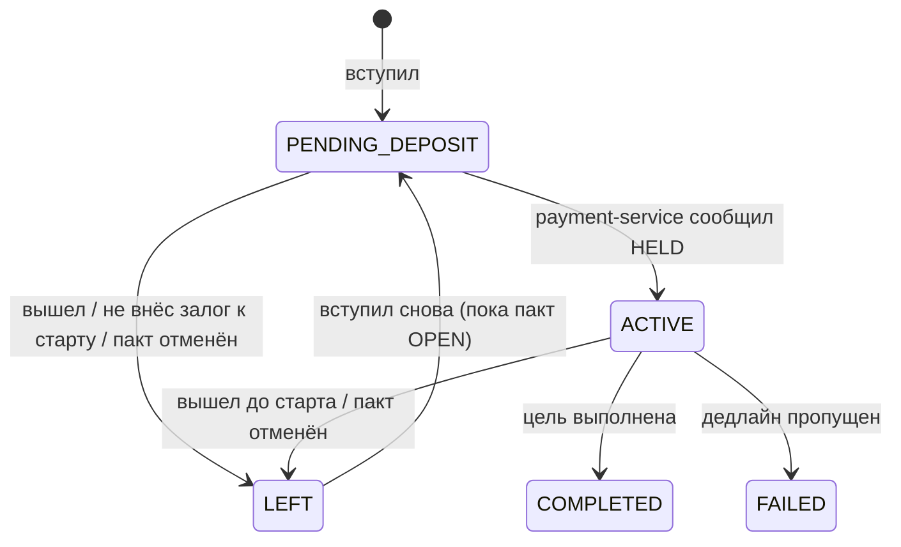
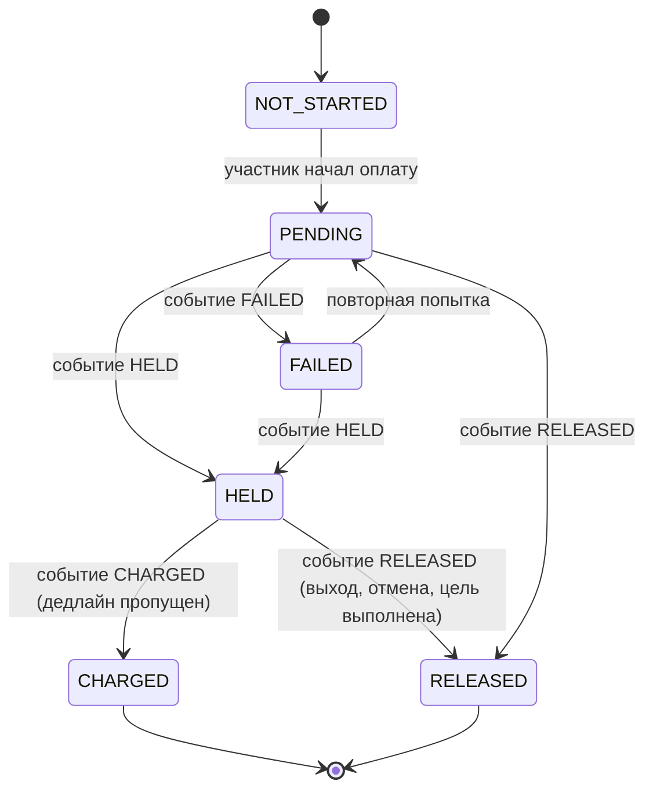

# CoGoal main-service — описание API

Документ описывает, как устроен main-сервис: запуск, аутентификация, модель данных и статусы, все эндпоинты, бизнес-правила, шедулер и где что лежит в коде. Интерактивная документация тех же эндпоинтов — Swagger UI: `http://localhost:8080/swagger-ui.html`.

## Содержание

1. [Что делает сервис](#1-что-делает-сервис)
2. [Запуск и настройки](#2-запуск-и-настройки)
3. [Аутентификация и доступ](#3-аутентификация-и-доступ)
4. [Общие соглашения API](#4-общие-соглашения-api)
5. [Модель данных и статусы](#5-модель-данных-и-статусы)
6. [Основной сценарий по шагам](#6-основной-сценарий-по-шагам)
7. [Эндпоинты](#7-эндпоинты)
8. [Бизнес-правила подробно](#8-бизнес-правила-подробно)
9. [Шедулер](#9-шедулер)
10. [Внешние сервисы (заглушки)](#10-внешние-сервисы-заглушки)
11. [Решения, принятые сверх ТЗ](#11-решения-принятые-сверх-тз)
12. [Карта кода](#12-карта-кода)
13. [Тесты](#13-тесты)
14. [Известные ограничения](#14-известные-ограничения)

---

## 1. Что делает сервис

Сервис взаимной подотчётности для достижения целей:

1. Пользователь создаёт **цель** (категория, дедлайн) и при желании делит её на **этапы** со своими дедлайнами.
2. Цель публикуется как **пакт**. Другие пользователи со своими целями **вступают** в пакт или их **приглашают**.
3. Каждый участник вносит **залог** (деньги замораживает payment-service).
4. Перед дедлайнами участник **отчитывается** (check-in) и прикладывает **доказательства** (файл, фото, ссылка); напарники **проверяют** отчёт.
5. Дедлайн пропущен → залог уходит в **благотворительный фонд** пакта. Цель выполнена → залог возвращается и начисляются **монеты (coins)**.
6. Монеты тратятся в **магазине** на косметику профиля (аватары, рамки, фоны).

### Место в системе



- **auth-service** — регистрация и логин, выдаёт JWT. Паролей в main нет. После регистрации создаёт профиль в main через `/internal/users`.
- **payment-service** — замораживает, списывает и возвращает залоги, результат сообщает событием в `/internal/payments/events`.
- **email-service** — письма.

Три внешних сервиса пока не готовы; main обращается к ним через интерфейсы с заглушками (раздел 10).

---

## 2. Запуск и настройки

### Требования

- Java 17+ (сборка идёт на JDK 25: `~/.jdks/openjdk-25.0.1`), Maven wrapper `./mvnw`.
- PostgreSQL. Схему создаёт **Liquibase** при старте; Hibernate только сверяет сущности со схемой (`ddl-auto: validate`).

### Обязательные переменные окружения

| Переменная | Зачем | Требование |
|---|---|---|
| `JWT_SECRET` | ключ HS256, которым auth-service подписывает токены | ≥ 32 символов, случайный, **одинаковый** с auth-service |
| `INTERNAL_TOKEN` | общий секрет для `/internal/**` (заголовок `X-Internal-Token`) | ≥ 16 символов, случайный |

Без них приложение не стартует и пишет, какого значения не хватает. Сгенерировать: `openssl rand -hex 32`.

### Остальные настройки (`application.yml`)

| Свойство | Переменная | По умолчанию | Смысл |
|---|---|---|---|
| `spring.datasource.url` | `DB_URL` | `jdbc:postgresql://localhost:5432/cg-test` | БД |
| `spring.datasource.username` / `password` | `DB_USERNAME` / `DB_PASSWORD` | `postgres` / `postgres` | |
| `security.jwt.issuer` | `JWT_ISSUER` | `pact-auth` | ожидаемый `iss` |
| `security.jwt.audience` | `JWT_AUDIENCE` | `pact-main` | должен быть в `aud` |
| `security.jwt.clock-skew` | — | `30s` | допуск расхождения часов для `exp`/`iat` |
| `app.coins.goal-completed` | `APP_COINS_GOAL_COMPLETED` | `100` | монет за выполненную цель |
| `app.deadlines.enabled` | `APP_DEADLINES_ENABLED` | `true` | включает шедулер |
| `app.deadlines.check-interval` | `APP_DEADLINES_CHECK_INTERVAL` | `5m` | как часто проверять дедлайны и напоминания |
| `app.deadlines.reminder-before` | `APP_DEADLINES_REMINDER_BEFORE` | `24h` | за сколько до дедлайна напоминать |
| `app.deadlines.payment-retry-interval` | `APP_DEADLINES_PAYMENT_RETRY_INTERVAL` | `1h` | как часто повторять неподтверждённые charge/release |
| `app.storage.path` | `APP_STORAGE_PATH` | `./data/proofs` | папка для файлов-доказательств |
| `app.storage.max-file-size` | `APP_STORAGE_MAX_FILE_SIZE` | `10MB` | лимит одного файла |
| `spring.servlet.multipart.max-request-size` | `APP_STORAGE_MAX_REQUEST_SIZE` | `12MB` | лимит всего multipart-запроса (должен быть больше лимита файла) |
| `spring.data.web.pageable.default-page-size` / `max-page-size` | — | `20` / `100` | пагинация |

Все `app.*` читаются в `config/AppProperties.java` и проверяются при старте.

### Запуск

В IntelliJ: Run → Edit Configurations → Environment variables:

```
JWT_SECRET=<значение>;INTERNAL_TOKEN=<значение>
```

Или из консоли:

```bash
JAVA_HOME=~/.jdks/openjdk-25.0.1 ./mvnw -DskipTests package
JWT_SECRET=... INTERNAL_TOKEN=... java -jar target/CoGoal-main-0.0.1-SNAPSHOT.jar
```

- Swagger UI: `/swagger-ui.html`, OpenAPI JSON: `/v3/api-docs`. Кнопка **Authorize** принимает bearer-токен (и отдельно `X-Internal-Token` для `/internal/**`).
- Загруженные файлы лежат в `./data/proofs` (папка в `.gitignore`).

---

## 3. Аутентификация и доступ

### JWT пользователя

Каждый запрос к `/api/v1/**` несёт заголовок `Authorization: Bearer <token>`. Токен выдаёт auth-service: **HS256**, подписан `JWT_SECRET`. Клеймы:

```json
{
  "iss": "pact-auth",
  "sub": "3f1c2a4e-9b7d-4c1e-8a2f-5d6e7f8a9b0c",
  "aud": "pact-main",
  "iat": 1790000000,
  "exp": 1790000900,
  "roles": ["USER"]
}
```

| Клейм | Проверка |
|---|---|
| подпись | HS256 с `JWT_SECRET`, другие алгоритмы отклоняются |
| `iss` | равен `security.jwt.issuer` |
| `aud` | содержит `security.jwt.audience` (строка или массив) |
| `exp`, `iat` | обязательны, срок проверяется с допуском `clock-skew` |
| `sub` | обязателен, должен быть UUID; это **id пользователя** (`users.id`) |
| `roles` | обязателен; массив строк или строка через пробел. `USER` → `ROLE_USER`, `ADMIN` → `ROLE_ADMIN` |

Поведение фильтра (`config/security/JwtAuthenticationFilter`):
- нет заголовка → запрос идёт дальше без пользователя, защищённый эндпоинт вернёт **401** `"Bearer token is required"`;
- токен есть, но невалиден (подпись, срок, iss, aud, клеймы) → сразу **401** `"Invalid or expired bearer token"` и заголовок `WWW-Authenticate: Bearer error="invalid_token"`.

### Id текущего пользователя

Единый способ — параметр контроллера `@CurrentUserId UUID userId` (или компонент `CurrentUser` в коде без контроллера). Id берётся из `sub` **без обращения к БД**, поэтому работает даже до того, как auth-service создал профиль. Эндпоинты, которым нужен профиль, в этом случае отвечают **404** `"Profile of user … has not been created yet"`.

### Роли и открытые пути

| Путь | Доступ |
|---|---|
| `/swagger-ui.html`, `/swagger-ui/**`, `/v3/api-docs/**`, `/error` | открыты |
| `/api/v1/admin/**` | только `ROLE_ADMIN` (иначе **403**) |
| `/api/v1/**` | любой валидный JWT |
| `/internal/**` | только заголовок `X-Internal-Token` (см. ниже) |

Права на конкретные ресурсы (владелец цели, участник пакта, автор отчёта) проверяются **в сервисах** и дают **403**.

### Внутренние эндпоинты `/internal/**`

Отдельная цепочка безопасности (`config/security/InternalSecurityConfig`, стоит раньше пользовательской):
- доступ только по `X-Internal-Token: <INTERNAL_TOKEN>`, сравнение за постоянное время;
- JWT пользователя там **не принимается**, а внутренний токен **не работает** на `/api/v1/**`.

### Как получить токен для ручной проверки

auth-service ещё нет, поэтому токен можно сделать на [jwt.io](https://jwt.io): алгоритм HS256, секрет — ваш `JWT_SECRET`, payload как выше (UUID в `sub`, `exp` в будущем). Или в Git Bash:

```bash
SECRET='<JWT_SECRET>'; SUB='<uuid пользователя>'; ROLES='["USER"]'   # для админа: '["USER","ADMIN"]'
b64() { openssl base64 -A | tr '+/' '-_' | tr -d '='; }
now=$(date +%s)
H=$(printf '{"alg":"HS256","typ":"JWT"}' | b64)
P=$(printf '{"iss":"pact-auth","sub":"%s","aud":"pact-main","iat":%d,"exp":%d,"roles":%s}' "$SUB" $now $((now+3600)) "$ROLES" | b64)
S=$(printf '%s.%s' "$H" "$P" | openssl dgst -sha256 -hmac "$SECRET" -binary | b64)
echo "$H.$P.$S"
```

Перед работой с пользователем создайте его профиль (вместо auth-service):

```bash
curl -X POST localhost:8080/internal/users \
  -H "X-Internal-Token: $INTERNAL_TOKEN" -H "Content-Type: application/json" \
  -d '{"id":"<тот же uuid>","email":"alice@example.com","username":"alice"}'
```

---

## 4. Общие соглашения API

- Префикс пользовательских эндпоинтов — `/api/v1`, внутренних — `/internal`.
- JSON. Время — ISO-8601 в UTC: `"2026-10-25T10:00:00Z"`. Деньги — число с двумя знаками (`500.00`), валюта всегда `RUB`.
- Id — UUID.

### Пагинация

Все списки постраничные. Параметры: `page` (с 0), `size` (по умолчанию 20, максимум 100 — больше обрезается до 100), `sort` (`sort=createdAt,desc`, можно несколько). Неизвестное поле сортировки → **400**. У каждого списка своя сортировка по умолчанию (указана в разделе 7).

Формат ответа:

```json
{
  "content": [ { "...": "..." } ],
  "page": { "size": 20, "number": 0, "totalElements": 1, "totalPages": 1 }
}
```

Исключение — чат: курсорная пагинация (раздел 7.7).

### Ошибки

Все ошибки — RFC 9457 **ProblemDetail**, `Content-Type: application/problem+json`:

```json
{ "type": "about:blank", "title": "Conflict", "status": 409, "detail": "The pact is not open for joining (status: ACTIVE)" }
```

Ошибка валидации дополнительно содержит список полей:

```json
{
  "type": "about:blank", "title": "Bad Request", "status": 400, "detail": "Validation failed",
  "errors": [ { "field": "deadline", "message": "must be a future date" } ]
}
```

| Код | Когда | Откуда в коде |
|---|---|---|
| 400 | валидация тела/параметров, кривой JSON, неизвестный enum, неизвестное поле сортировки | `jakarta.validation` на DTO, Spring MVC |
| 401 | нет токена / токен невалиден / нет или неверный `X-Internal-Token` | фильтры безопасности |
| 403 | нет прав: не админ, чужой ресурс, не участник пакта, самопроверка | `ForbiddenException` |
| 404 | ресурса нет; профиль ещё не создан | `NotFoundException` |
| 409 | нарушено бизнес-правило или статус не позволяет действие; гонка, пойманная уникальным индексом БД | `BusinessRuleException`, `DataIntegrityViolationException` |
| 413 | файл больше `app.storage.max-file-size` | загрузка доказательств |
| 502 | payment-service недоступен при оплате залога | `ExternalServiceException` |

Обработчик — `web/error/GlobalExceptionHandler`.

---

## 5. Модель данных и статусы

### Таблицы



Особенности схемы:
- `users.id` не генерируется — приходит из auth-service (равен `sub`). Паролей и полей блокировки в main нет.
- Создатель пакта — владелец `pact.goal` (отдельной колонки нет). У каждого участника, включая создателя, своя цель `pact_participant.goal_id` и свой залог `deposit_amount / deposit_currency / deposit_status`.
- `pact_participant (pact_id, user_id)` уникален: вышедший и вернувшийся пользователь получает свою старую строку обратно.
- Одна цель — один пакт: частичный уникальный индекс `goal_id WHERE status <> 'LEFT'` (вышедшие не считаются).
- Одно ожидающее приглашение на пару (пакт, приглашённый): частичный уникальный индекс `WHERE status = 'PENDING'`.
- `coin_transaction (reason, reference_id)` уникален — одна выплата на цель и одна запись на покупку, повторно не начислится даже при гонке.
- `reminder_sent_at` у этапа и у участника — чтобы напоминание ушло один раз.
- `category.is_active` добавлена миграцией (удаление категории с целями = деактивация).
- Время хранится в `TIMESTAMP` без зоны, в UTC.

Миграции: `src/main/resources/db/changeset/001–020`, мастер — `db.changelog-master.xml`. 001–014 — исходные, **не редактировать**; изменения только новыми файлами `021-...` и дальше.

### Статусы

Хранятся строками (`@Enumerated(STRING)`), enum'ы в `db/entity/enums`.

**Цель (Goal)**



Редактировать и удалять цель и её этапы можно **только в DRAFT**.

**Этап (Milestone):** `PENDING` → `COMPLETED` (отчёт одобрен) или `FAILED` (дедлайн пропущен).

**Пакт (Pact)**



**Участник (PactParticipant)**



**Залог (DepositStatus)**



`CHARGED` и `RELEASED` — финальные. `NOT_STARTED` и `PENDING` ставит только main, payment-service их не присылает.

**Отчёт (CheckIn):** `PENDING` → `APPROVED` или `REJECTED` (решает первая проверка).
**Проверка (Review):** `APPROVED`, `REJECTED` (при отклонении нужен комментарий).
**Доказательство (Proof):** `FILE`, `PHOTO` (файл), `LINK` (ссылка).
**Приглашение (Invitation):** `PENDING` → `ACCEPTED` / `DECLINED` / `CANCELLED` (пакт стартовал или отменён).
**Тикет (SupportTicket):** `OPEN`, `IN_PROGRESS`, `CLOSED` — админ ставит любой.
**Товар (ShopItem type):** `AVATAR`, `FRAME`, `BACKGROUND`.
**Операция с монетами (CoinReason):** `GOAL_COMPLETED` (+), `PURCHASE` (−).

---

## 6. Основной сценарий по шагам

Именно этот сценарий проходит интеграционный тест `PactLifecycleIntegrationTest` на реальной БД.

| # | Кто | Запрос | Результат |
|---|---|---|---|
| 1 | админ | `POST /api/v1/admin/categories`, `POST /api/v1/admin/charities` | категория и фонд |
| 2 | auth-service | `POST /internal/users` ×2 | профили Алисы и Боба |
| 3 | Алиса | `POST /api/v1/goals`, `POST /api/v1/goals/{id}/milestones` | цель DRAFT с этапом |
| 4 | Алиса | `POST /api/v1/pacts` `{goalId, charityId, depositAmount}` | пакт OPEN, Алиса PENDING_DEPOSIT, цель IN_PACT |
| 5 | Боб | `GET /api/v1/goals/feed` → `POST /api/v1/pacts/{id}/join` | Боб PENDING_DEPOSIT |
| 6 | оба | `POST /api/v1/pacts/{id}/deposit` | ссылка на оплату, залог PENDING |
| 7 | payment-service | `POST /internal/payments/events` `{participantId, event: HELD}` ×2 | оба ACTIVE |
| 8 | Алиса | `POST /api/v1/pacts/{id}/start` | пакт ACTIVE |
| 9 | Алиса | `POST /api/v1/pacts/{id}/check-ins` `{milestoneId}` + `POST /api/v1/check-ins/{id}/proofs` | отчёт по этапу PENDING |
| 10 | Боб | `GET /api/v1/check-ins/to-review` → `POST /api/v1/check-ins/{id}/reviews` `{status: APPROVED}` | этап COMPLETED |
| 11 | Алиса | `POST /api/v1/pacts/{id}/check-ins` (без `milestoneId`) | финальный отчёт |
| 12 | Боб | одобряет финальный отчёт | цель COMPLETED, +100 монет, запрос на возврат залога, письмо |
| 13 | шедулер | Боб пропустил дедлайн | Боб FAILED, залог в фонд, пакт FINISHED |
| 14 | Алиса | `POST /api/v1/shop/items/{id}/purchase`, `PUT /api/v1/users/me/avatar` | покупка, аватар надет |

---

## 7. Эндпоинты

Условные обозначения: **Кто** — кто может вызвать; ответ `Page<X>` — постраничный список (раздел 4).

### 7.1 Профиль — `UserController`

| Метод и путь | Кто | Тело / параметры | Ответ | Правила и ошибки |
|---|---|---|---|---|
| `GET /api/v1/users/me` | любой | — | 200 `MyProfileResponse` | 404, если профиль не создан |
| `PATCH /api/v1/users/me` | любой | `{username?, firstName?, lastName?}` | 200 `MyProfileResponse` | `null`-поля не меняются; пустой `username` → 400 |
| `PUT /api/v1/users/me/avatar` | любой | `{shopItemId}` | 200 `MyProfileResponse` | товар должен быть типа `AVATAR` и куплен → иначе 409; нет товара → 404 |
| `GET /api/v1/users/{id}` | любой | — | 200 `PublicProfileResponse` | без email и coins; 404 |
| `GET /api/v1/users?search=` | любой | `search` обязателен (≤ 50) | 200 `Page<PublicProfileResponse>` | поиск по части username без учёта регистра; **сам вызывающий исключён**; сортировка `username` |
| `GET /api/v1/users/me/purchases` | любой | — | 200 `Page<PurchaseResponse>` | новые сверху |
| `GET /api/v1/users/me/coin-transactions` | любой | — | 200 `Page<CoinTransactionResponse>` | новые сверху |

`MyProfileResponse`: `id, username, email, firstName, lastName, avatarUrl, activeAvatar{id,name,itemType}, coins, createdAt`.
`PublicProfileResponse`: `id, username, firstName, lastName, avatarUrl, activeAvatarItemId, createdAt`.

### 7.2 Справочники — `CatalogController`

| Метод и путь | Кто | Ответ | Правила |
|---|---|---|---|
| `GET /api/v1/categories` | любой | 200 `Page<CategoryResponse>` | только активные, по имени |
| `GET /api/v1/charities` | любой | 200 `Page<CharityResponse>` | только активные, по имени |

### 7.3 Цели и этапы — `GoalController`, `MilestoneController`

| Метод и путь | Кто | Тело / параметры | Ответ | Правила и ошибки |
|---|---|---|---|---|
| `POST /api/v1/goals` | любой | `{categoryId, title, description?, deadline}` | 201 `GoalResponse` | цель DRAFT; `deadline` в будущем (400); категория активна (409) |
| `GET /api/v1/goals/my?status=` | любой | `status` необязателен | 200 `Page<GoalSummaryResponse>` | новые сверху |
| `GET /api/v1/goals/feed?categoryId=` | любой | `categoryId` необязателен | 200 `Page<FeedItemResponse>` | чужие цели IN_PACT в пактах OPEN; сортировка по дедлайну цели |
| `GET /api/v1/goals/{id}` | см. правило | — | 200 `GoalResponse` | свою видно всегда; чужой **DRAFT** → 403; чужую в пакте видно |
| `PATCH /api/v1/goals/{id}` | владелец | `{categoryId?, title?, description?, deadline?}` | 200 `GoalResponse` | только DRAFT (409); не владелец → 403; дедлайн цели не раньше дедлайнов этапов (409) |
| `DELETE /api/v1/goals/{id}` | владелец | — | 204 | только DRAFT; этапы удаляются вместе с целью |
| `POST /api/v1/goals/{id}/milestones` | владелец | `{title, description?, deadline}` | 201 `MilestoneResponse` | только DRAFT; `deadline` обязателен, в будущем, не позже дедлайна цели (409) |
| `PATCH /api/v1/milestones/{id}` | владелец цели | `{title?, description?, deadline?}` | 200 `MilestoneResponse` | только DRAFT; те же проверки дедлайна |
| `DELETE /api/v1/milestones/{id}` | владелец цели | — | 204 | только DRAFT |

`GoalResponse`: `id, ownerId, category{id,name}, title, description, deadline, status, milestones[], createdAt, updatedAt` (этапы по дедлайну).
`FeedItemResponse`: `goal{…}, owner{id,username}, pactId` — `pactId` нужен, чтобы вступить.

### 7.4 Пакты и залоги — `PactController`

| Метод и путь | Кто | Тело | Ответ | Правила и ошибки |
|---|---|---|---|---|
| `POST /api/v1/pacts` | любой | `{goalId, charityId, depositAmount}` | 201 `PactResponse` | своя цель в DRAFT; фонд активен; создатель — первый участник PENDING_DEPOSIT |
| `GET /api/v1/pacts/my` | любой | — | 200 `Page<PactSummaryResponse>` | все пакты пользователя, включая вышедшие; с его статусом и статусом залога |
| `GET /api/v1/pacts/{id}` | см. правило | — | 200 `PactResponse` | OPEN видно всем; иначе только тем, кто в нём участвовал (403) |
| `POST /api/v1/pacts/{id}/join` | любой | `{goalId, depositAmount}` | 200 `PactResponse` | пакт OPEN; ещё не участник; своя цель DRAFT |
| `POST /api/v1/pacts/{id}/leave` | участник | — | 204 | только пока OPEN; создатель не может (409, нужно отменять) |
| `POST /api/v1/pacts/{id}/start` | создатель | — | 200 `PactResponse` | пакт OPEN; ≥ 2 участника ACTIVE; не заплатившие → LEFT, их цели → DRAFT; приглашения отменяются |
| `DELETE /api/v1/pacts/{id}` | создатель | — | 204 | только OPEN; все (включая создателя) → LEFT, цели → DRAFT, залоги возвращаются |
| `POST /api/v1/pacts/{id}/deposit` | участник | — | 200 `DepositStartResponse` | залог → PENDING, возвращает `paymentUrl`; можно повторять при PENDING/FAILED; при HELD → 409; payment-service недоступен → 502 |
| `GET /api/v1/pacts/{id}/deposit` | участник | — | 200 `DepositResponse` | свой залог |

`depositAmount` — положительное число, максимум два знака после запятой.
`PactResponse`: `id, status, creatorId, goalId, charity{id,name}, createdAt, participants[]` — участники без LEFT, в порядке вступления. Участник: `id, user{id,username}, goal{…}, status, depositAmount, depositCurrency, depositStatus, joinedAt`.

### 7.5 Приглашения — `InvitationController`

| Метод и путь | Кто | Тело / параметры | Ответ | Правила и ошибки |
|---|---|---|---|---|
| `POST /api/v1/pacts/{id}/invitations` | участник пакта (не LEFT) | `{inviteeId}` | 201 `InvitationResponse` | пакт OPEN; не себя; приглашённый существует (404), ещё не участник, без ожидающего приглашения (409); письмо после коммита |
| `GET /api/v1/invitations/my?status=` | любой | `status` необязателен | 200 `Page<InvitationResponse>` | адресованные мне, новые сверху |
| `POST /api/v1/invitations/{id}/accept` | приглашённый | `{goalId, depositAmount}` | 200 `PactResponse` | то же, что `join`; приглашение → ACCEPTED |
| `POST /api/v1/invitations/{id}/decline` | приглашённый | — | 200 `InvitationResponse` | приглашение → DECLINED |

Ответить можно только на PENDING (иначе 409), только своё (иначе 403). Если приглашённый вступил через `join`, его ожидающее приглашение тоже становится ACCEPTED.

### 7.6 Отчёты, доказательства, проверки — `CheckInController`, `ProofController`

| Метод и путь | Кто | Тело / параметры | Ответ | Правила и ошибки |
|---|---|---|---|---|
| `POST /api/v1/pacts/{id}/check-ins` | ACTIVE-участник ACTIVE-пакта | `{milestoneId?, comment?}` | 201 `CheckInResponse` | см. 8.4 |
| `GET /api/v1/pacts/{id}/check-ins` | участник (не LEFT) | — | 200 `Page<CheckInSummaryResponse>` | новые сверху |
| `GET /api/v1/check-ins/{id}` | участник пакта | — | 200 `CheckInResponse` | с доказательствами и проверками |
| `GET /api/v1/check-ins/to-review` | любой | — | 200 `Page<CheckInSummaryResponse>` | ожидающие отчёты напарников, которые я ещё не проверял; старые сверху |
| `POST /api/v1/check-ins/{id}/reviews` | другой ACTIVE-участник | `{status, comment?}` | 201 `CheckInResponse` | см. 8.5 |
| `POST /api/v1/check-ins/{id}/proofs` (multipart) | автор | части `file`, `type=FILE\|PHOTO`, `description?` | 201 `ProofResponse` | отчёт PENDING (409); пустой файл → 400; PHOTO не картинка → 400; больше лимита → 413 |
| `POST /api/v1/check-ins/{id}/proofs` (JSON) | автор | `{externalUrl, description?}` | 201 `ProofResponse` | тип LINK; только `http`/`https` (400) |
| `DELETE /api/v1/proofs/{id}` | автор | — | 204 | отчёт PENDING; файл удаляется с диска после коммита |
| `GET /api/v1/proofs/{id}/file` | участник пакта | — | 200 файл | всегда `Content-Disposition: attachment` |

`CheckInResponse`: `id, pactId, participantId, author{id,username}, goalId, milestone{id,title,deadline}|null, finalReport, status, comment, submittedAt, proofs[], reviews[]`.
`ProofResponse`: `id, type, downloadUrl, externalUrl, description, uploadedAt` — для файлов `downloadUrl = /api/v1/proofs/{id}/file`, путь хранения наружу не отдаётся.

Пример загрузки фото:

```bash
curl -X POST localhost:8080/api/v1/check-ins/<id>/proofs -H "Authorization: Bearer $TOKEN" \
  -F "file=@finish.jpg;type=image/jpeg" -F "type=PHOTO" -F "description=Финиш"
```

### 7.7 Чат — `MessageController`

| Метод и путь | Кто | Параметры / тело | Ответ |
|---|---|---|---|
| `GET /api/v1/pacts/{id}/messages?before=&limit=` | участник (не LEFT) | `before` — время (необязательно), `limit` 1–100, по умолчанию 50 | 200 `MessagePageResponse` |
| `POST /api/v1/pacts/{id}/messages` | участник (не LEFT) | `{text}` (≤ 2000) | 201 `MessageResponse` |

Курсорная пагинация: ответ `{messages: [...новые сверху], nextBefore}`. Чтобы получить более старые, передайте `nextBefore` как `before`. `nextBefore = null` — сообщений больше нет.

### 7.8 Магазин — `ShopController`

| Метод и путь | Кто | Ответ | Правила |
|---|---|---|---|
| `GET /api/v1/shop/items?type=` | любой | 200 `Page<ShopItemResponse>` | только в продаже, дешёвые сверху |
| `POST /api/v1/shop/items/{id}/purchase` | любой | 201 `{purchase, coinsLeft}` | см. 8.7 |

### 7.9 Поддержка — `SupportController`

| Метод и путь | Кто | Тело | Ответ | Правила |
|---|---|---|---|---|
| `POST /api/v1/support/tickets` | любой | `{subject, description?}` | 201 `SupportTicketResponse` | статус OPEN |
| `GET /api/v1/support/tickets/my` | любой | — | 200 `Page<…>` | новые сверху |
| `GET /api/v1/support/tickets/{id}` | автор | — | 200 | чужой → 403 |

### 7.10 Админка (`ROLE_ADMIN`)

| Путь | Операции |
|---|---|
| `/api/v1/admin/categories` | `GET` (все, включая неактивные), `GET /{id}`, `POST`, `PUT /{id}`, `DELETE /{id}` |
| `/api/v1/admin/charities` | то же |
| `/api/v1/admin/shop-items` | то же |
| `/api/v1/admin/support-tickets?status=` | `GET` (старые сверху, с автором и email) |
| `/api/v1/admin/support-tickets/{id}` | `PATCH {status}` — любой статус, в том числе переоткрыть |

- `POST` → 201 и заголовок `Location`.
- `PUT` — полная замена полей; если `active` не передан, текущее значение сохраняется. Новая цена товара не меняет прошлые покупки.
- `DELETE` → 200 `{"outcome": "DELETED"}` или `{"outcome": "DEACTIVATED"}`: запись, на которую есть ссылки, не удаляется, а получает `is_active = false` (категория — если есть цели, фонд — если есть пакты, товар — если его покупали).
- Имя категории уникально (409).

Тела запросов: категория `{name, description?, active?}`, фонд `{name, description?, websiteUrl?, active?}`, товар `{name, description?, price > 0, itemType, active?}`.

### 7.11 Внутренние (`X-Internal-Token`)

| Метод и путь | Кто вызывает | Тело | Ответ | Правила |
|---|---|---|---|---|
| `POST /internal/users` | auth-service | `{id, email, username}` | 201 — создан, 200 — уже был | идемпотентно, существующий профиль не меняется; email занят другим id → 409 |
| `POST /internal/payments/events` | payment-service | `{participantId, event: HELD\|CHARGED\|RELEASED\|FAILED}` | 200 `DepositResponse` | идемпотентно, см. 8.3 |

---

## 8. Бизнес-правила подробно

### 8.1 Цели и этапы (`service/GoalService`)

- Цель создаётся в DRAFT. Менять и удалять цель и её этапы может только владелец и только в DRAFT.
- Дедлайн цели в будущем. Дедлайн этапа обязателен, в будущем и не позже дедлайна цели. Сдвинуть дедлайн цели раньше дедлайна какого-то этапа нельзя.
- При удалении DRAFT-цели сначала удаляются её старые строки участия со статусом LEFT (FK `goal_id` запрещает удаление, пока на цель ссылаются).
- Если удаляется цель создателя отменённого пакта, этот пакт удаляется вместе с ней (FK `pact.goal_id ON DELETE CASCADE` в исходной схеме).

### 8.2 Пакт (`service/PactService`)

- **Создание:** своя DRAFT-цель + активный фонд + сумма залога → пакт OPEN, создатель — участник PENDING_DEPOSIT (залог NOT_STARTED), цель → IN_PACT.
- **Вступление / принятие приглашения:** пакт OPEN, пользователь ещё не участник, своя DRAFT-цель → участник PENDING_DEPOSIT, цель → IN_PACT.
  - Вышедший (LEFT) может вернуться, пока пакт OPEN: переиспользуется его старая строка. Но только если прежний залог «успокоился» (NOT_STARTED, FAILED или RELEASED), иначе 409 — чтобы не смешать два платежа.
- **Выход (`leave`):** только пока OPEN; создатель выйти не может. Участник → LEFT, цель → DRAFT, залог HELD → запрос на возврат.
- **Старт (`start`):** только создатель, пакт OPEN, ≥ 2 участника ACTIVE. Пакт → ACTIVE; PENDING_DEPOSIT → LEFT, их цели → DRAFT; ожидающие приглашения → CANCELLED.
- **Отмена (`DELETE`):** только создатель и только пока OPEN. Все участники, включая создателя, → LEFT, цели → DRAFT, залоги HELD → возврат, приглашения → CANCELLED.
- **Блокировки:** каждое изменение пакта сначала берёт блокировку строки пакта (`SELECT … FOR UPDATE`, `PactService.lock`) и только потом читает остальное. Поэтому параллельные join/leave/start/cancel, проверки и события оплаты по одному пакту выполняются по очереди и видят свежие данные.

### 8.3 Залоги (`service/DepositService`)

- `POST /pacts/{id}/deposit`: участник PENDING_DEPOSIT в OPEN-пакте. Залог → PENDING **и коммитится**, только потом вызывается `PaymentClient.holdDeposit` (медленный платёжный сервис не держит блокировку пакта). Если вызов упал — залог остаётся PENDING, ответ 502, можно повторить.
- **События от payment-service** (идемпотентны):

  | Событие | Из каких статусов применяется | Что ещё происходит |
  |---|---|---|
  | HELD | NOT_STARTED, PENDING, FAILED | участник PENDING_DEPOSIT в OPEN-пакте → ACTIVE; если участник уже LEFT (вышел или выбыл при старте) — сразу запрос на возврат |
  | FAILED | NOT_STARTED, PENDING | участник остаётся PENDING_DEPOSIT и может платить снова |
  | CHARGED | HELD | — |
  | RELEASED | любой нефинальный | — |

  Повтор того же события ничего не меняет. События, которые вывели бы залог из финального статуса (например, поздний HELD после RELEASED), игнорируются с предупреждением в логе. Ответ всегда 200 с текущим состоянием.

### 8.4 Отчёты (`service/CheckInService`)

- Создаёт только ACTIVE-участник ACTIVE-пакта, только по **своей** цели в этом пакте.
- `milestoneId` — этап своей цели в статусе PENDING. `milestoneId = null` — **финальный отчёт** по цели; он разрешён, только когда **все этапы COMPLETED**.
- Только до дедлайна (этапа или цели; у этапа без дедлайна — дедлайн цели).
- По одному этапу (и по цели) не может быть второго отчёта, пока есть PENDING или APPROVED. После REJECTED можно подать новый.
- Доказательства добавляет и удаляет только автор, пока отчёт PENDING. Если транзакция с новым файлом откатилась, файл удаляется с диска.

### 8.5 Проверка отчётов (`service/ReviewService`, `service/ReviewDecisionPolicy`)

- Проверяет другой ACTIVE-участник того же ACTIVE-пакта. Себя — нельзя (403). Каждый проверяет отчёт один раз.
- Проверять можно только отчёт PENDING, у которого автор ещё ACTIVE и этап ещё PENDING.
- При REJECTED комментарий обязателен (400).
- **Правило решения живёт в одном месте — `ReviewDecisionPolicy.decide`.** Сейчас решает первая проверка: APPROVED → отчёт APPROVED, REJECTED → отчёт REJECTED. Чтобы сделать, например, «большинство», достаточно поменять только этот метод: он получает все проверки и число напарников и может вернуть «ждать дальше».
- Последствия одобрения:
  - отчёт по этапу → этап COMPLETED;
  - финальный отчёт → **цель выполнена сразу** (8.6).
- Проверять можно и после дедлайна, если отчёт подан вовремя (8.6).

### 8.6 Дедлайны, выполнение и провал (`service/DeadlineService`, `service/GoalOutcomeService`)

**Выполнение цели** (одобрен финальный отчёт): цель → COMPLETED, участник → COMPLETED, +`app.coins.goal-completed` монет с записью в `coin_transaction` (`GOAL_COMPLETED`, reference = id цели), запрос на возврат залога, письмо с итогом.

**Провал** (шедулер): у ACTIVE-участника ACTIVE-пакта пропущен дедлайн этапа или цели без APPROVED-отчёта →
просроченные этапы → FAILED, цель → FAILED, участник → FAILED, запрос на списание залога в фонд пакта, письмо.

**Отчёт на проверке в момент дедлайна** (решение «вариант A»):
- отчёт подан вовремя, но напарники ещё не проверили — решение **откладывается**;
- одобрили позже — этап/цель засчитаны;
- отклонили после дедлайна — на следующем запуске шедулера провал (подать новый отчёт уже нельзя);
- если дедлайн **цели** прошёл, а финального отчёта нет (даже если отчёты по этапам ещё на проверке) — провал сразу: финальный отчёт после дедлайна подать нельзя.

**Завершение пакта:** когда в ACTIVE-пакте не осталось ACTIVE-участников, пакт → FINISHED.

**Идемпотентность:** выполнение и провал действуют только на ACTIVE-участника, повторный запуск ничего не меняет. Монеты дополнительно защищены уникальным индексом `(reason, reference_id)`. Тесты проверяют, что второй запуск не списывает, не возвращает и не начисляет повторно.

### 8.7 Магазин (`service/ShopService`)

Покупка — одна транзакция:
1. блокировка строки пользователя (покупки одного пользователя идут по очереди);
2. товар есть (404) и в продаже (409), ещё не куплен этим пользователем (409);
3. атомарное списание `UPDATE users SET coins = coins - :price WHERE id = :id AND coins >= :price`; 0 строк → 409 «Not enough coins»;
4. запись в `purchase` с ценой на момент покупки;
5. запись в `coin_transaction` (`PURCHASE`, −цена, reference = id покупки).

Ответ содержит `coinsLeft` — баланс после покупки, прочитанный из БД.

---

## 9. Шедулер

`service/scheduler/DeadlineScheduler`, включается `app.deadlines.enabled`.

| Задача | Интервал | Что делает |
|---|---|---|
| `checkDeadlines` | `check-interval` (5 мин) | 1) напоминания об этапах; 2) напоминания о дедлайне цели; 3) решения по дедлайнам (8.6) |
| `retryUnsettledDeposits` | `payment-retry-interval` (1 ч) | повторно отправляет charge/release для залогов, всё ещё HELD у FAILED / COMPLETED / LEFT участников |

- Каждый элемент обрабатывается в своей транзакции; ошибка по одному пишется в лог и не останавливает остальных.
- **Напоминание** уходит, когда до дедлайна осталось не больше `reminder-before`, ровно один раз: условный `UPDATE … SET reminder_sent_at = now WHERE reminder_sent_at IS NULL` «забирает» напоминание только у одного запуска. Для этапа без дедлайна отдельного напоминания нет (напомнит дедлайн цели).
- Безопасно запускать несколько экземпляров приложения: всё идемпотентно, изменения пакта идут под блокировкой.

---

## 10. Внешние сервисы (заглушки)

Бизнес-логика зависит только от интерфейсов. Реальные HTTP-клиенты нужно будет реализовать, подменив бины.

| Интерфейс | Заглушка | Методы |
|---|---|---|
| `client/payment/PaymentClient` | `StubPaymentClient` — пишет в лог, `holdDeposit` возвращает `https://payment.stub.local/pay/{participantId}` | `holdDeposit(participantId, userId, amount, currency) → paymentUrl`, `charge(participantId, charityId)`, `release(participantId)` |
| `client/email/EmailClient` | `StubEmailClient` — пишет в лог | `sendPactInvitation`, `sendDeadlineReminder`, `sendPactResult` |
| `storage/FileStorage` | `LocalFileStorage` — **рабочая** реализация на локальном диске | `store`, `load`, `delete` |

- **Пока нет payment-service,** результат оплаты имитируется вручную: `POST /internal/payments/events` с `X-Internal-Token` и событием `HELD` (или другим).
- **Когда вызываются:** `charge`, `release` и все письма отправляются **после коммита** транзакции (`service/event/ExternalCallsListener`, `@TransactionalEventListener`). Откат не отправит деньги и не пошлёт письмо. Ошибка вызова пишется в лог; неподтверждённые charge/release повторяет шедулер.
- **Ожидание от payment-service:** повторный `charge`/`release` для того же участника он должен считать одним.
- `LocalFileStorage` хранит файлы под сгенерированными именами (`<uuid>.<расширение>`), имя от клиента не используется — выйти за пределы папки нельзя.

---

## 11. Решения, принятые сверх ТЗ

**Согласованные:**

| Решение | Почему |
|---|---|
| MapStruct для всего маппинга | запрос |
| Одна цель — один пакт через частичный индекс `WHERE status <> 'LEFT'` | иначе вышедший не смог бы использовать цель снова |
| `category.is_active` | ТЗ требует деактивацию, а колонки не было |
| `application.yml`, `iss/aud = pact-auth/pact-main` | по ТЗ |
| Удаление DRAFT-цели удаляет её старые LEFT-строки | FK `RESTRICT` иначе не даст удалить |
| Отмена пакта возвращает цели всех в DRAFT | в ТЗ не описано |
| Отчёт на проверке в момент дедлайна откладывает провал (вариант A) | автор не наказывается за медленных проверяющих |

**Принятые самостоятельно** (при необходимости легко поменять):

| Решение | Где поменять |
|---|---|
| Колонки `reminder_sent_at` для однократных напоминаний | миграции 016, 020 |
| Уникальный `(reason, reference_id)` в `coin_transaction` | миграция 018 |
| Чужой DRAFT → 403; пакт после OPEN виден только участникам | `GoalService.get`, `PactService.get` |
| Поиск пользователей исключает вызывающего | `UserService.search` |
| Все списки постраничные, включая справочники | контроллеры |
| Вышедший может вернуться в пакт (со своей старой строкой) | `PactService.enroll` |
| Отмена пакта только пока OPEN | `PactService.cancel` |
| Оплату залога можно запрашивать повторно (PENDING / FAILED) | `DepositService.PAYABLE` |
| Финальный отчёт — только когда все этапы COMPLETED | `CheckInService.requireFinalReportAllowed` |
| Отчёт — только до дедлайна | `CheckInService.requireBeforeDeadline` |
| Эндпоинт скачивания `GET /proofs/{id}/file` (в ТЗ нет) | `ProofController` |
| Повторная покупка того же товара → 409 | `ShopService.purchase` |
| Админ ставит тикету любой статус | `SupportService.changeStatus` |
| Удаление в админке возвращает `DELETED`/`DEACTIVATED` | сервисы справочников |
| Напоминание при ошибке отправки не повторяется | `ExternalCallsListener` |

---

## 12. Карта кода

Базовый пакет `edu.stankin.cogoalmain`:

```
config/                 AppProperties (app.*), AppConfig (Clock), WebMvcConfig, OpenApiConfig, SchedulingConfig
config/security/        JWT: JwtAuthenticationFilter, JwtDecoderConfig, JwtProperties, SecurityConfig
                        internal: InternalTokenFilter, InternalSecurityConfig
                        текущий пользователь: CurrentUser, @CurrentUserId, CurrentUserIdArgumentResolver
                        ответы 401/403: RestAuthenticationEntryPoint, RestAccessDeniedHandler, SecurityErrorResponses
db/entity/              JPA-сущности (BaseEntity — equals/hashCode по id), db/entity/enums — статусы
db/repo/                Spring Data репозитории, запросы с fetch join / @EntityGraph
exception/              NotFoundException (404), ForbiddenException (403), BusinessRuleException (409), ExternalServiceException (502)
service/                бизнес-логика, проверки прав, транзакции
service/event/          события и ExternalCallsListener (вызовы после коммита)
service/scheduler/      DeadlineScheduler
client/payment, client/email   интерфейсы внешних сервисов и заглушки
storage/                FileStorage, LocalFileStorage
web/controllers/        REST (admin/, internal/ — отдельно)
web/dto/                request/response records по областям
web/mapper/             MapStruct-мапперы, общий CentralMapperConfig
web/error/              GlobalExceptionHandler
```

Где искать правило:

| Хочу поменять | Файл |
|---|---|
| проверку токена, роли, открытые пути | `config/security/SecurityConfig`, `JwtDecoderConfig`, `JwtTokenService` |
| правило решения по проверкам | `service/ReviewDecisionPolicy` |
| когда цель проваливается / выполняется | `service/DeadlineService.decide`, `service/GoalOutcomeService` |
| жизненный цикл пакта | `service/PactService` |
| переходы статусов залога | `service/DepositService` (`isAllowed`, `PAYABLE`) |
| правила отчётов | `service/CheckInService` |
| покупку | `service/ShopService` |
| формат ошибок | `web/error/GlobalExceptionHandler`, `config/security/SecurityErrorResponses` |
| поля ответа | `web/dto/...` + соответствующий маппер в `web/mapper` |

**Правила изменения кода:**
- Новое поле в сущности или DTO: MapStruct настроен с `unmappedTargetPolicy = ERROR` — если поле нигде не замаплено и не помечено `ignore`, сборка упадёт. Это защита, а не ошибка.
- Изменение схемы: новый changeset `021-...xml` + строка в мастер-файле. Иначе `ddl-auto: validate` не даст стартовать.
- Сервисы принимают request-DTO и возвращают response-DTO, маппинг внутри транзакции (`open-in-view` выключен — ленивые связи в контроллере не загрузятся).

---

## 13. Тесты

```bash
JAVA_HOME=~/.jdks/openjdk-25.0.1 ./mvnw test
```

| Вид | Что проверяет |
|---|---|
| unit-тесты сервисов (Mockito) | правила пакта, залогов, отчётов, проверок, дедлайнов с идемпотентностью, магазина |
| `@WebLayerTest` (MockMvc) | безопасность, валидация, формат ошибок, коды ответов — с настоящими подписанными токенами |
| `JpaModelAndQueriesTest` | поднимает контекст **без БД** и проверяет все HQL-запросы и маппинг сущностей |
| `CoGoalMainApplicationTests` | реальная PostgreSQL: Liquibase + `validate` + индексы |
| `PactLifecycleIntegrationTest` | основной сценарий целиком на реальной PostgreSQL (раздел 6) |

Два последних требуют БД: Docker (Testcontainers) **или** внешнюю пустую базу:

```bash
IT_DB_URL=jdbc:postgresql://localhost:5432/cg-it IT_DB_USERNAME=postgres IT_DB_PASSWORD=postgres ./mvnw test
```

Без них эти тесты помечаются как пропущенные с объяснением. Для тестовых токенов — `src/test/java/.../support/TestTokens`.

---

## 14. Известные ограничения

- **Отчёт, который никто не проверяет,** держит участника в ожидании бесконечно (следствие варианта A). Решение — таймаут проверки: например, авто-одобрение или провал через N дней после дедлайна.
- **Повтор charge/release раз в час** рассчитан на то, что payment-service идемпотентен по участнику.
- **Нет эндпоинта снять аватар** (`PUT /users/me/avatar` только ставит купленный).
- **У товаров нет картинки** — в схеме `shop_item` нет поля под изображение.
- **Курсор чата — только по `created_at`:** сообщения с абсолютно одинаковым временем на границе страницы теоретически могут пропасть (время хранится с микросекундами, на практике маловероятно).
- **Файлы хранятся локально,** при нескольких экземплярах приложения нужно общее хранилище (новая реализация `FileStorage`).
